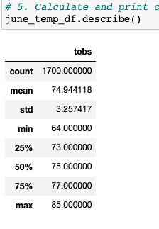
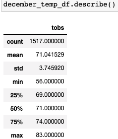
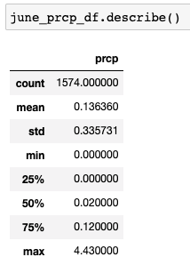
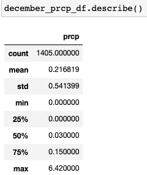

# Surfs Up- Ice Cream and Surf Shop

## Project Overview
The purpose of this project as to help the client W. Avy to better understand the the weather during the June and December months.  The client asked to look at the temperature summary statistics for these two months.  Using the weather data in the sqlite database, the data was filter for the months of interest and then put into a list in Pandas and summary statistics were perfomred on both months.  As an additional check, precipitation statistics are also included for those months.  The goal is to make sure that clients are up for surfing and ice cream throughout the year.

### Results

Refering to the following two images of the summary statistics tables.  Key take aways are:

1. The mean temperature in June is 4 degrees warmer (~75 degrees F) than in December (~71 degrees F)
2. The minimum/maximum temperature observed in December was 56 and 83 degrees F vs 64 and 85 degrees F in June
3. On average the quartiles are 3-4 degrees warmer in June than in December

### Summary
Overall the weather is very similar in June and Decemeber.  June is generally slightly warmer but due to the islands location in the tropics and the surrounding Pacific Ocean.  As an additional query, the precipitation summary statistics were run for the months of June and December.  The figures below are the summary statistics of June and December respectively:

 

As seen in the figures above the rainfall averages 0.2 inches during the month of December.  This is nearly double the average of 0.136 inches in the month.  Additionally the maximum value is two inches more in December than in June.  Overall however, the rainfall seems manageable and combined with the low variance in the temperatures doesn't seem likely to deter surfers.